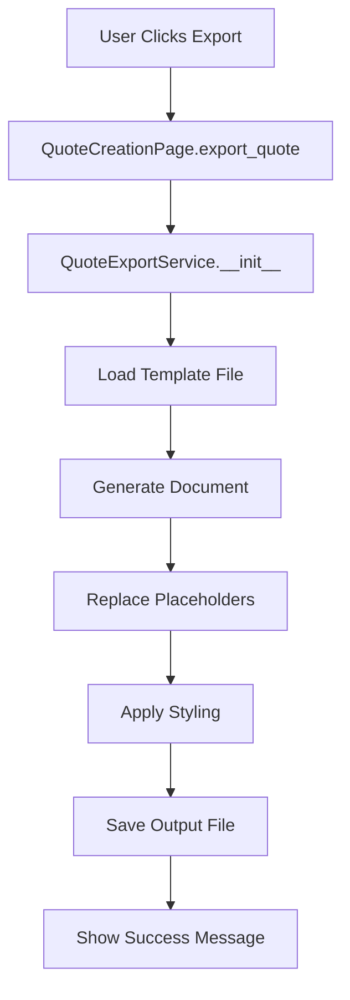

# MyBabbittQuote Template System

This documentation covers the complete template system for the MyBabbittQuote export functionality. The templates enable customizable document generation for quotes, invoices, estimates, and proposals in multiple formats.

## 📁 Template Files Overview

### Current Template Files

| File | Purpose | Format | Status |
|------|---------|--------|--------|
| `pdf_styles.py` | PDF styling configuration | Python Module | ✅ Complete |
| `quote_template.docx` | Word document template | DOCX | 🔄 In Development |
| `email_template.html` | Email template | HTML | 🔄 In Development |
| `pdf_template.py` | PDF generation template | Python Module | 🔄 In Development |

### Template File Descriptions

#### 📄 `pdf_styles.py`
**Purpose**: Centralized styling configuration for PDF documents
- **Contains**: Page layouts, typography, colors, spacing, table styles, branding
- **Usage**: Import styling constants for consistent PDF generation
- **Customizable**: Colors, fonts, company branding, document types
- **Target Users**: Developers implementing PDF generation

#### 📄 `quote_template.docx` 
**Purpose**: Microsoft Word template for quote documents
- **Contains**: Placeholder text, formatting, tables, headers/footers
- **Usage**: Loaded by `QuoteExportService` for Word document generation
- **Customizable**: Layout, styling, placeholder positions, company branding
- **Target Users**: End-users who need to customize quote appearance

#### 📄 `email_template.html`
**Purpose**: HTML template for email notifications and quotes
- **Contains**: HTML structure, CSS styling, email-specific formatting
- **Usage**: Email integration for sending quotes directly to customers
- **Customizable**: HTML layout, CSS styles, email signatures
- **Target Users**: End-users configuring email communications

#### 📄 `pdf_template.py`
**Purpose**: Python-based PDF template with ReportLab integration
- **Contains**: PDF generation logic, layout definitions, content structure
- **Usage**: Advanced PDF customization beyond basic styling
- **Customizable**: Document structure, advanced layouts, complex tables
- **Target Users**: Developers requiring custom PDF generation

## 🎨 Template Customization Guide

### For End-Users (Business Users)

#### Customizing Word Templates (`quote_template.docx`)

1. **Open the Template**:
   ```
   Open data/templates/quote_template.docx in Microsoft Word
   ```

2. **Modify Basic Elements**:
   - Change company logo (replace existing image)
   - Update header/footer text
   - Modify fonts and colors
   - Adjust table layouts

3. **Preserve Placeholders**:
   - Keep placeholder text like `{{quote_number}}` intact
   - Move placeholders but don't delete them
   - Ensure placeholders remain in single text runs

4. **Save Changes**:
   - Save as `.docx` format
   - Maintain original filename and location

#### Customizing Company Branding

1. **Update PDF Styles**:
   ```python
   # Edit data/templates/pdf_styles.py
   COMPANY_BRANDING = {
       'company_name': 'Your Company Name Here',
       'company_tagline': 'Your Professional Tagline',
       'company_address': [
           'Your Street Address',
           'Suite/Unit Number',
           'City, State ZIP'
       ],
       'company_contact': {
           'phone': '(555) 123-4567',
           'email': 'your-email@company.com',
           'website': 'www.yourcompany.com'
       }
   }
   ```

2. **Logo Configuration**:
   ```python
   'logo': {
       'path': 'data/templates/your-logo.png',
       'width': 120,    # Adjust size as needed
       'height': 40,    # Adjust size as needed
       'position': 'top_left'  # or 'top_center', 'top_right'
   }
   ```

3. **Color Scheme**:
   ```python
   COLORS = {
       'primary': colors.Color(0.2, 0.4, 0.8),  # Your brand blue
       'secondary': colors.Color(0.3, 0.7, 0.5), # Your brand green
       # Update other colors as needed
   }
   ```

### For Developers

#### Creating New Templates

1. **Follow Naming Convention**:
   ```
   {document_type}_template.{extension}
   
   Examples:
   - invoice_template.docx
   - estimate_template.html
   - proposal_template.py
   ```

2. **Template Structure**:
   ```
   data/templates/
   ├── {type}_template.{ext}     # Main template file
   ├── {type}_styles.py          # Styling configuration (if needed)
   └── assets/                   # Supporting files (logos, images)
       ├── logo.png
       └── watermark.png
   ```

3. **Integration Pattern**:
   ```python
   # In export service
   class QuoteExportService:
       def __init__(self, template_path):
           self.template_path = template_path
           
       def generate_document(self, quote_details, output_path):
           # Template loading and processing logic
           pass
   ```

## 🏷️ Placeholder Syntax & Variables

### Standard Placeholder Format
```
{{variable_name}}
```

### Available Variables

#### Customer Information
| Placeholder | Description | Example |
|-------------|-------------|---------|
| `{{customer_name}}` | Customer full name | "John Smith" |
| `{{customer_company}}` | Customer company | "Acme Industries" |
| `{{customer_email}}` | Customer email | "john@acme.com" |
| `{{customer_phone}}` | Customer phone | "(555) 123-4567" |
| `{{customer_address}}` | Customer address | "123 Main St, City, ST 12345" |

#### Quote Information
| Placeholder | Description | Example |
|-------------|-------------|---------|
| `{{quote_number}}` | Quote reference number | "Q-2024-0001" |
| `{{quote_date}}` | Quote creation date | "2024-01-15" |
| `{{expiration_date}}` | Quote expiration date | "2024-02-14" |
| `{{quote_status}}` | Current quote status | "Draft" / "Sent" / "Accepted" |
| `{{total_price}}` | Total quote amount | "$1,234.56" |
| `{{subtotal}}` | Subtotal before tax | "$1,200.00" |
| `{{tax_amount}}` | Tax amount | "$34.56" |
| `{{notes}}` | Quote notes/comments | "Special delivery instructions" |

#### Company Information
| Placeholder | Description | Example |
|-------------|-------------|---------|
| `{{company_name}}` | Your company name | "Babbitt International" |
| `{{company_address}}` | Your company address | "123 Business Ave" |
| `{{company_phone}}` | Your company phone | "(555) 987-6543" |
| `{{company_email}}` | Your company email | "quotes@babbitt.com" |
| `{{company_website}}` | Your company website | "www.babbitt.com" |

#### Special Placeholders
| Placeholder | Description | Usage |
|-------------|-------------|-------|
| `{{line_items_table}}` | Product line items | Word templates only |
| `{{current_date}}` | Today's date | Auto-generated |
| `{{page_number}}` | Current page number | PDF headers/footers |
| `{{total_pages}}` | Total page count | PDF headers/footers |

#### Advanced Variables (for developers)
```python
# Access nested data in templates
{{products.0.name}}           # First product name
{{products.0.options.0.name}} # First option of first product
{{customer.billing_address}}  # Nested customer data
```

## 📋 File Naming Conventions

### Template Files
```
{document_type}_template.{extension}

Examples:
- quote_template.docx
- invoice_template.docx
- estimate_template.html
- proposal_template.py
```

### Generated Documents
```
{document_type}_{quote_number}_{customer_name}.{extension}

Examples:
- Quote_Q2024001_Acme_Industries.docx
- Invoice_INV2024001_Smith_Corp.pdf
- Estimate_EST2024001_Tech_Solutions.html
```

### Supporting Files
```
{purpose}_{modifier}.{extension}

Examples:
- logo_primary.png
- logo_grayscale.png
- watermark_confidential.png
- styles_corporate.css
```

## 🔧 Export Service Integration

### Service Architecture
```
src/core/services/export_service.py
├── QuoteExportService        # Main export coordinator
├── QuotePDFGenerator        # PDF-specific generation
├── QuoteWordGenerator       # Word-specific generation
└── QuoteEmailGenerator      # Email-specific generation
```

### Integration Flow


### Template Loading Process
1. **Template Path Resolution**:
   ```python
   template_path = f"data/templates/{document_type}_template.{extension}"
   ```

2. **Template Validation**:
   ```python
   if not os.path.exists(template_path):
       raise FileNotFoundError(f"Template not found: {template_path}")
   ```

3. **Template Processing**:
   ```python
   # For Word templates
   document = Document(template_path)
   
   # For PDF templates
   from data.templates.pdf_styles import COLORS, FONTS
   
   # For HTML templates
   with open(template_path, 'r') as f:
       template_content = f.read()
   ```

### Adding New Document Types

1. **Create Template File**:
   ```
   data/templates/new_type_template.docx
   ```

2. **Add Export Method**:
   ```python
   def export_new_type(self, quote_details, output_path):
       template_path = "data/templates/new_type_template.docx"
       exporter = QuoteExportService(template_path)
       exporter.generate_word_document(quote_details, output_path)
   ```

3. **Update UI**:
   ```python
   # Add button/menu item for new document type
   new_type_btn = QPushButton("Export New Type")
   new_type_btn.clicked.connect(self.export_new_type)
   ```

## 🔍 Troubleshooting Common Issues

### Template Loading Issues

#### Problem: "Template file not found"
```
FileNotFoundError: Template not found: data/templates/quote_template.docx
```

**Solutions**:
1. Verify file exists in correct location
2. Check file permissions
3. Ensure filename matches exactly (case-sensitive)
4. Verify file isn't corrupted

#### Problem: "Template file is corrupted"
```
BadZipFile: File is not a zip file
```

**Solutions**:
1. Re-save template in Microsoft Word
2. Check file wasn't truncated during transfer
3. Ensure file is valid .docx format
4. Try opening file manually in Word first

### Placeholder Issues

#### Problem: Placeholders not being replaced
```
Output still shows: {{customer_name}} instead of actual name
```

**Troubleshooting Steps**:
1. **Check Placeholder Syntax**:
   ```
   ✅ Correct: {{customer_name}}
   ❌ Wrong:   {customer_name}
   ❌ Wrong:   {{customer name}}  (no spaces)
   ❌ Wrong:   {{ customer_name }} (extra spaces)
   ```

2. **Check Data Source**:
   ```python
   # Verify data is available
   print(quote_details.get('customer', {}).get('name'))
   ```

3. **Check Text Runs in Word**:
   - Placeholder might be split across multiple text runs
   - Retype placeholder manually in Word
   - Use "Paste Special > Unformatted Text" when copying placeholders

#### Problem: Placeholder appears in output but data is missing
```
Output shows: "John Smith" but should show "Acme Industries"
```

**Solutions**:
1. Check placeholder mapping in export service
2. Verify correct data field is being accessed
3. Check for typos in variable names

### PDF Generation Issues

#### Problem: PDF styling not applied
```
PDF generates but uses default styling instead of custom styles
```

**Solutions**:
1. Verify `pdf_styles.py` is being imported correctly:
   ```python
   from data.templates.pdf_styles import COLORS, FONTS, PAGE_LAYOUT
   ```

2. Check style application:
   ```python
   # Ensure styles are being used
   canvas.setFillColor(COLORS['primary'])
   canvas.setFont(FONTS['body_text']['family'], FONTS['body_text']['size'])
   ```

3. Verify color format:
   ```python
   # Colors should be ReportLab Color objects
   from reportlab.lib import colors
   COLORS['primary'] = colors.Color(0.2, 0.4, 0.8)  # RGB values 0-1
   ```

#### Problem: PDF layout issues
```
Text overlapping, tables malformed, content cut off
```

**Solutions**:
1. Check page margins and content dimensions:
   ```python
   content_width = PAGE_LAYOUT['content_width']
   margin_left = PAGE_LAYOUT['margin_left']
   ```

2. Verify table column widths:
   ```python
   table = Table(data, colWidths=[1*inch, 3*inch, 1*inch])
   ```

3. Check text wrapping and paragraph spacing

### Email Template Issues

#### Problem: HTML template rendering incorrectly
```
Email displays raw HTML or formatting is broken
```

**Solutions**:
1. Validate HTML syntax
2. Use inline CSS for email compatibility
3. Test in multiple email clients
4. Avoid complex CSS layouts

#### Problem: Images not displaying in emails
```
Images show as broken links in email clients
```

**Solutions**:
1. Use base64 encoded images for small logos
2. Host images on web server for larger files
3. Provide alt text for accessibility
4. Test image paths and permissions

### Performance Issues

#### Problem: Slow document generation
```
Export takes several seconds for simple quotes
```

**Solutions**:
1. **Optimize template loading**:
   ```python
   # Cache templates in memory for repeated use
   self._template_cache = {}
   
   def load_template(self, template_path):
       if template_path not in self._template_cache:
           self._template_cache[template_path] = Document(template_path)
       return self._template_cache[template_path]
   ```

2. **Minimize database queries**:
   ```python
   # Load all needed data in single query
   quote_details = QuoteService.get_full_quote_details(db, quote_id)
   ```

3. **Optimize image handling**:
   ```python
   # Resize images before embedding
   # Use compressed image formats
   # Cache processed images
   ```

### Data Integration Issues

#### Problem: Quote data not matching template expectations
```
KeyError: 'line_items' - Template expects data that doesn't exist
```

**Solutions**:
1. **Use defensive data access**:
   ```python
   line_items = quote_details.get('line_items', [])
   customer_name = quote_details.get('customer', {}).get('name', 'N/A')
   ```

2. **Validate data structure**:
   ```python
   def validate_quote_data(quote_details):
       required_fields = ['quote_number', 'customer', 'line_items']
       for field in required_fields:
           if field not in quote_details:
               raise ValueError(f"Missing required field: {field}")
   ```

3. **Provide default values**:
   ```python
   def get_safe_value(data, path, default='N/A'):
       try:
           for key in path.split('.'):
               data = data[key]
           return data
       except (KeyError, TypeError):
           return default
   
   # Usage
   customer_name = get_safe_value(quote_details, 'customer.name')
   ```

## 🚀 Advanced Customization

### Custom Document Types

1. **Define Document Configuration**:
   ```python
   # In pdf_styles.py
   DOCUMENT_TYPES['proposal'] = {
       'title': 'PROJECT PROPOSAL',
       'watermark_text': 'PROPOSAL',
       'color_scheme': 'secondary',
       'show_executive_summary': True,
       'footer_disclaimer': 'This proposal is confidential.'
   }
   ```

2. **Create Export Method**:
   ```python
   def export_proposal(self, quote_details, output_path):
       doc_config = get_document_config('proposal')
       # Use doc_config to customize generation
   ```

### Dynamic Template Selection

```python
def get_template_path(quote_details, format_type):
    """Select template based on quote characteristics."""
    quote_value = quote_details.get('total_price', 0)
    customer_tier = quote_details.get('customer', {}).get('tier', 'standard')
    
    if quote_value > 10000:
        template_name = f'premium_{format_type}_template'
    elif customer_tier == 'vip':
        template_name = f'vip_{format_type}_template'
    else:
        template_name = f'{format_type}_template'
    
    return f'data/templates/{template_name}.docx'
```

### Multi-Language Support

```python
# Template selection by language
def get_localized_template(document_type, language='en'):
    """Get template for specific language."""
    template_name = f'{document_type}_template_{language}.docx'
    template_path = f'data/templates/{template_name}'
    
    if not os.path.exists(template_path):
        # Fallback to English
        template_path = f'data/templates/{document_type}_template.docx'
    
    return template_path

# Placeholder localization
PLACEHOLDERS_ES = {
    '{{customer_name}}': '{{nombre_cliente}}',
    '{{quote_number}}': '{{numero_cotizacion}}',
    # ... other translations
}
```

## 📚 Additional Resources

### Useful Tools
- **Microsoft Word**: Template editing and formatting
- **ReportLab Documentation**: PDF generation capabilities
- **Python-docx Documentation**: Word document manipulation
- **HTML/CSS Validators**: Email template validation

### Reference Files
- `src/core/services/export_service.py` - Main export logic
- `src/core/services/quote_service.py` - Quote data access
- `data/templates/pdf_styles.py` - PDF styling configuration
- `requirements.txt` - Required dependencies

### Development Best Practices
1. Always backup templates before modifications
2. Test templates with sample data before deployment
3. Validate generated documents in target applications
4. Keep template files under version control
5. Document any custom modifications
6. Use consistent naming conventions
7. Implement error handling for template operations

### Getting Help
- Check this README for common issues
- Review export service code for implementation details
- Test templates with sample quotes
- Contact development team for complex customizations
- Refer to ReportLab/python-docx documentation for advanced features

---

*Last Updated: 2024-01-15*  
*Version: 1.0*  
*Maintained by: Development Team*