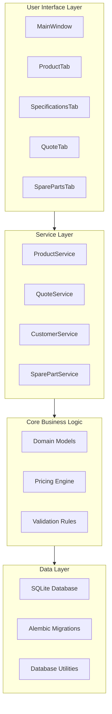
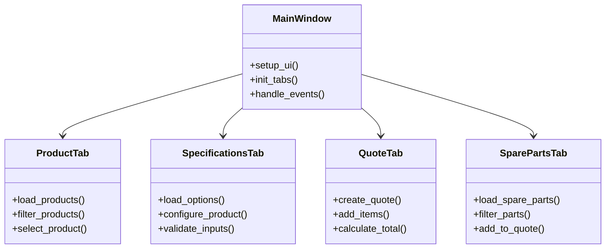
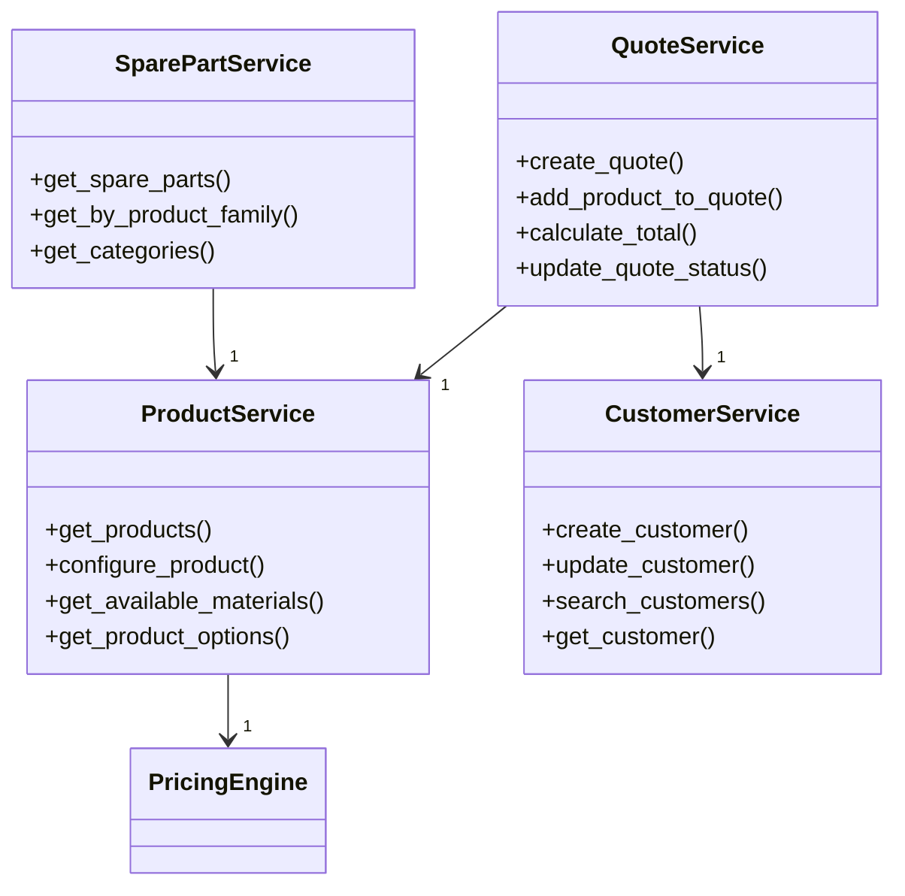
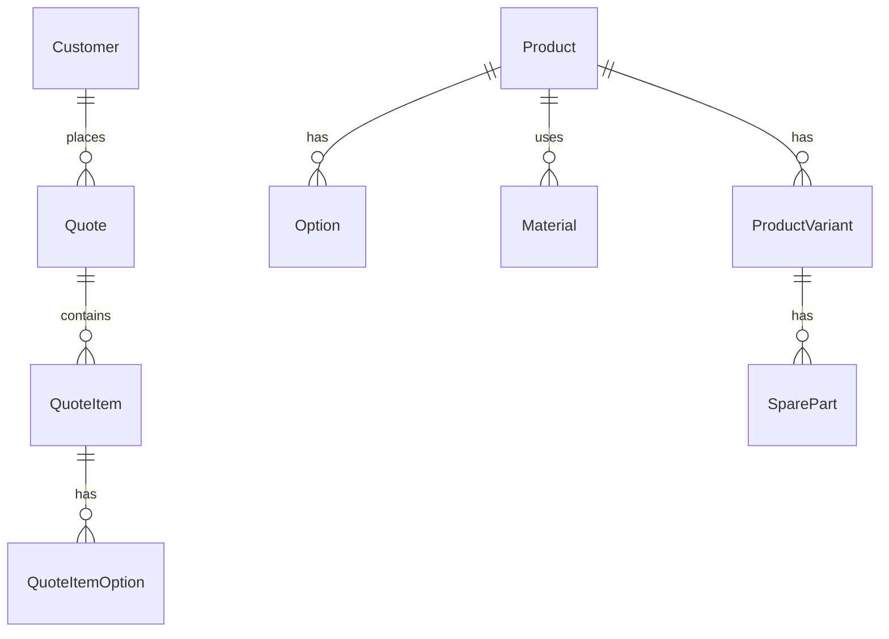
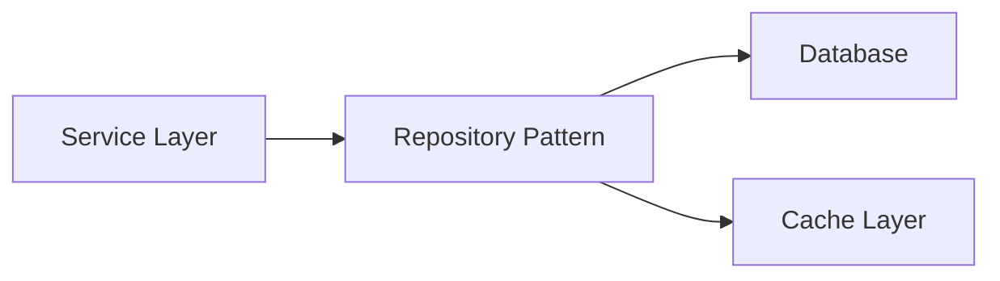
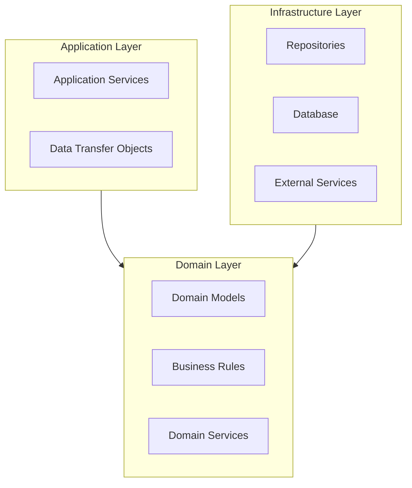
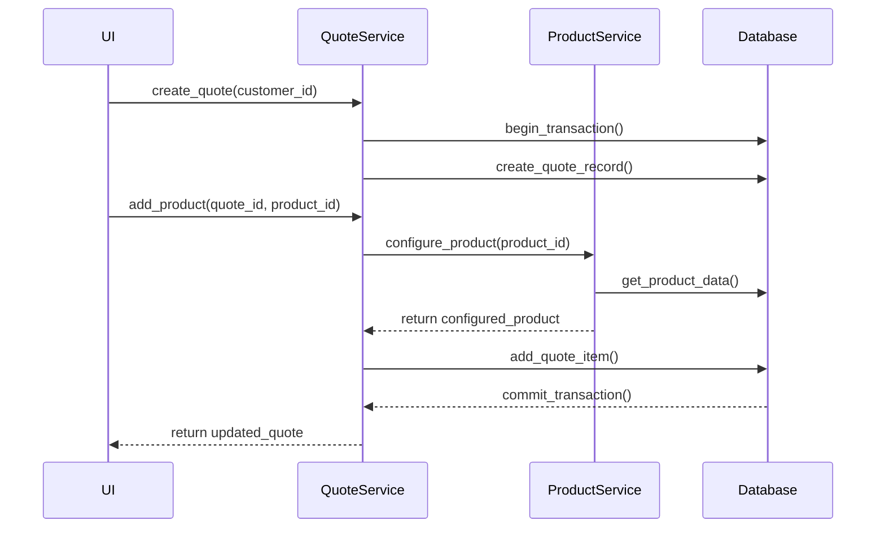
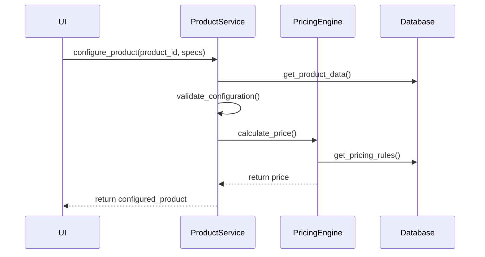
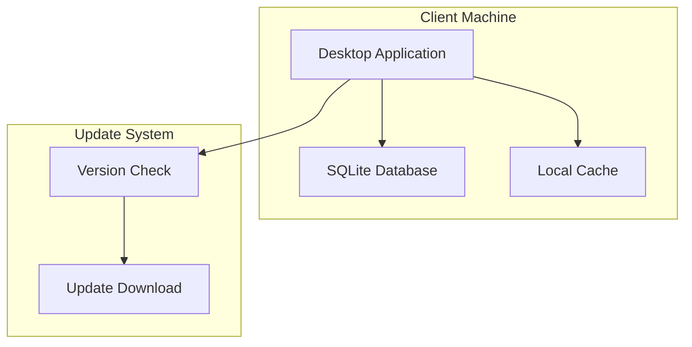
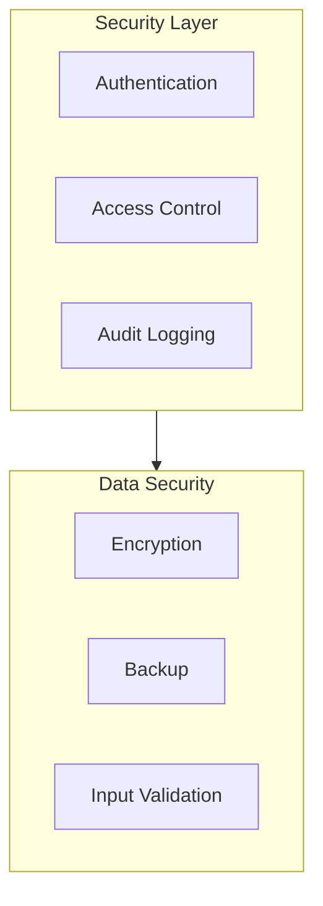

# MyBabbittQuote Architecture Overview

This document provides a comprehensive overview of the MyBabbittQuote system architecture, including component relationships, data flow, and key design decisions.

## System Architecture

## Component Details

### UI Layer Components

### Service Layer

### Data Models

## Key Design Patterns

### Repository Pattern

### Domain-Driven Design

## Data Flow

### Quote Creation Flow

### Product Configuration Flow

## Deployment Architecture

## Security Architecture

## Notes and Considerations

### Performance Optimizations
- Database indexing on frequently queried fields
- Caching of product and pricing data
- Lazy loading of UI components
- Batch processing for bulk operations

### Scalability
- Modular design allows for easy addition of new features
- Service layer can be extended for new business rules
- Database schema supports future product types
- UI components are reusable and extensible

### Maintenance
- Clear separation of concerns
- Comprehensive logging
- Error handling at all layers
- Automated testing coverage

## Related Documentation
- [Developer Guide](./developer_guide.md)
- [Database Schema](./database_schema.md)
- [API Documentation](./api_docs.md)
- [Testing Strategy](./testing_strategy.md) 