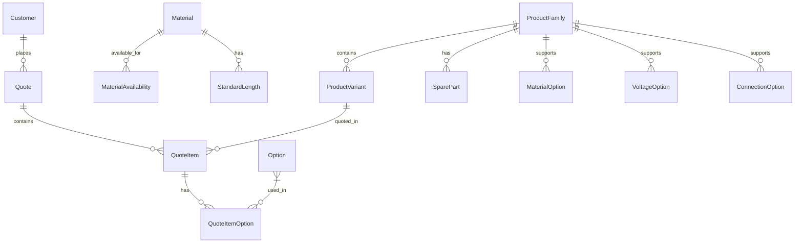

# Database Schema Documentation

## Overview
This document describes the database schema for the MyBabbittQuote system. The schema is designed to support product configuration, quoting, and customer management for Babbitt International's industrial products. The system uses SQLite as the database engine with SQLAlchemy ORM for data access.

## Entity Relationship Diagram



## Core Tables

### ProductFamily
Represents a family of related products (e.g., LS2000 series).

| Column      | Type    | Description                  | Usage                  |
| ----------- | ------- | ---------------------------- | ---------------------- |
| id          | Integer | Primary key                  | Internal reference     |
| name        | String  | Family name (e.g., "LS2000") | Display and filtering  |
| description | Text    | Family description           | Product documentation  |
| category    | String  | Product category             | Grouping and filtering |

Indexes:
- Primary Key: `id`
- Index: `name` (frequently used in searches)
- Index: `category` (used in product filtering)

### ProductVariant
Specific product configurations within a family.

| Column            | Type    | Description                  | Usage                  |
| ----------------- | ------- | ---------------------------- | ---------------------- |
| id                | Integer | Primary key                  | Internal reference     |
| product_family_id | Integer | Foreign key to ProductFamily | Relationship mapping   |
| model_number      | String  | Unique model number          | Product identification |
| description       | Text    | Variant description          | Product documentation  |
| base_price        | Float   | Base price                   | Quote calculations     |
| base_length       | Float   | Base length in inches        | Length calculations    |
| voltage           | String  | Voltage configuration        | Product specification  |
| material          | String  | Material code                | Material selection     |

Indexes:
- Primary Key: `id`
- Foreign Key: `product_family_id` (frequently joined)
- Index: `model_number` (used in searches)

### Material
Defines materials and their pricing rules.

| Column                           | Type    | Description                    | Usage               |
| -------------------------------- | ------- | ------------------------------ | ------------------- |
| id                               | Integer | Primary key                    | Internal reference  |
| code                             | String  | Material code (e.g., "S", "H") | Material selection  |
| name                             | String  | Material name                  | Display purposes    |
| description                      | Text    | Material description           | Documentation       |
| base_length                      | Float   | Standard base length           | Length calculations |
| length_adder_per_inch            | Float   | Cost per inch                  | Price calculations  |
| length_adder_per_foot            | Float   | Cost per foot                  | Price calculations  |
| has_nonstandard_length_surcharge | Boolean | If surcharge applies           | Price calculations  |
| nonstandard_length_surcharge     | Float   | Surcharge amount               | Price calculations  |
| base_price_adder                 | Float   | Base price addition            | Price calculations  |

Indexes:
- Primary Key: `id`
- Unique Index: `code` (used in material selection)

## Quote Management

### Quote
Quote header information.

| Column          | Type     | Description             | Usage                |
| --------------- | -------- | ----------------------- | -------------------- |
| id              | Integer  | Primary key             | Internal reference   |
| quote_number    | String   | Unique quote number     | Quote identification |
| customer_id     | Integer  | Foreign key to Customer | Customer reference   |
| date_created    | DateTime | Creation timestamp      | Audit trail          |
| expiration_date | DateTime | Expiration date         | Quote validity       |
| status          | String   | Quote status            | Workflow management  |
| notes           | Text     | Additional notes        | Documentation        |

Indexes:
- Primary Key: `id`
- Unique Index: `quote_number` (used in searches)
- Foreign Key: `customer_id` (frequently joined)

### QuoteItem
Individual line items in a quote.

| Column           | Type    | Description                   | Usage                 |
| ---------------- | ------- | ----------------------------- | --------------------- |
| id               | Integer | Primary key                   | Internal reference    |
| quote_id         | Integer | Foreign key to Quote          | Quote reference       |
| product_id       | Integer | Foreign key to ProductVariant | Product reference     |
| quantity         | Integer | Quantity                      | Order calculations    |
| unit_price       | Float   | Price per unit                | Price calculations    |
| length           | Float   | Length in inches              | Length calculations   |
| material         | String  | Material code                 | Material reference    |
| voltage          | String  | Voltage spec                  | Product specification |
| description      | Text    | Line item description         | Documentation         |
| discount_percent | Float   | Discount percentage           | Price calculations    |

Indexes:
- Primary Key: `id`
- Foreign Key: `quote_id` (frequently joined)
- Foreign Key: `product_id` (frequently joined)

## Configuration Tables

### Option
Product options and add-ons.

| Column            | Type    | Description         | Usage                  |
| ----------------- | ------- | ------------------- | ---------------------- |
| id                | Integer | Primary key         | Internal reference     |
| name              | String  | Option name         | Display and selection  |
| description       | Text    | Option description  | Documentation          |
| price             | Float   | Option price        | Price calculations     |
| price_type        | String  | Pricing type        | Price calculations     |
| category          | String  | Option category     | Grouping and filtering |
| product_families  | String  | Compatible families | Option validation      |
| excluded_products | String  | Excluded products   | Option validation      |

Indexes:
- Primary Key: `id`
- Index: `name` (used in searches)
- Index: `category` (used in filtering)

## Implementation Details

### Data Access Layer
- SQLAlchemy ORM for database operations
- Repository pattern for data access
- Unit of Work pattern for transactions
- Caching layer for frequently accessed data

### Common Queries
1. Product Search:
```sql
SELECT * FROM ProductVariant 
WHERE model_number LIKE :search_term 
OR description LIKE :search_term;
```

2. Quote Generation:
```sql
SELECT q.*, qi.*, p.* 
FROM Quote q 
JOIN QuoteItem qi ON q.id = qi.quote_id 
JOIN ProductVariant p ON qi.product_id = p.id 
WHERE q.quote_number = :quote_number;
```

3. Material Pricing:
```sql
SELECT m.*, sl.* 
FROM Material m 
LEFT JOIN StandardLength sl ON m.code = sl.material_code 
WHERE m.code = :material_code;
```

### Performance Optimizations
1. Indexed Fields:
   - Product model numbers (frequent searches)
   - Quote numbers (lookup operations)
   - Customer names (search operations)
   - Material codes (pricing calculations)

2. Caching Strategy:
   - Product catalog (frequently accessed)
   - Material pricing (calculation intensive)
   - Standard lengths (reference data)

3. Query Optimization:
   - Eager loading for quote generation
   - Lazy loading for option lists
   - Batch operations for quote items

### Data Validation
1. Input Validation:
   - Length constraints
   - Price range validation
   - Material compatibility
   - Voltage requirements

2. Business Rules:
   - Material availability checks
   - Option compatibility validation
   - Price calculation rules
   - Quote expiration handling

### Security Measures
1. Data Protection:
   - Input sanitization
   - SQL injection prevention
   - Parameterized queries
   - Access control

2. Audit Trail:
   - Quote modifications
   - Price changes
   - Customer updates
   - Configuration changes

## Migration Strategy
1. Version Control:
   - Alembic migrations
   - Schema version tracking
   - Rollback procedures

2. Data Integrity:
   - Foreign key constraints
   - Unique constraints
   - Default values
   - Not null constraints

## Backup and Recovery
1. Regular Backups:
   - Daily full backups
   - Transaction logs
   - Point-in-time recovery

2. Recovery Procedures:
   - Database restoration
   - Data validation
   - Integrity checks 