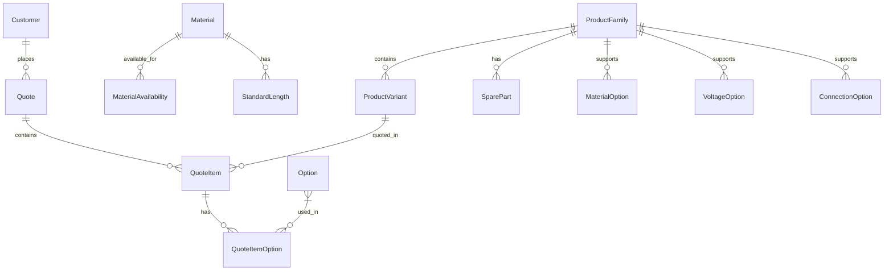

# Database Schema Documentation

## Overview
This document describes the database schema for the MyBabbittQuote system. The schema is designed to support product configuration, quoting, and customer management for Babbitt International's industrial products.

## Entity Relationship Diagram

## Tables

### Product-Related Tables

#### ProductFamily
Represents a family of related products (e.g., LS2000 series).

| Column | Type | Description |
|--------|------|-------------|
| id | Integer | Primary key |
| name | String | Family name (e.g., "LS2000") |
| description | Text | Family description |
| category | String | Product category |

Indexes:
- Primary Key: `id`
- Index: `name`
- Index: `category`

#### ProductVariant
Specific product configurations within a family.

| Column | Type | Description |
|--------|------|-------------|
| id | Integer | Primary key |
| product_family_id | Integer | Foreign key to ProductFamily |
| model_number | String | Unique model number |
| description | Text | Variant description |
| base_price | Float | Base price |
| base_length | Float | Base length in inches |
| voltage | String | Voltage configuration |
| material | String | Material code |

Indexes:
- Primary Key: `id`
- Foreign Key: `product_family_id`
- Index: `model_number`

### Material-Related Tables

#### Material
Defines materials and their pricing rules.

| Column | Type | Description |
|--------|------|-------------|
| id | Integer | Primary key |
| code | String | Material code (e.g., "S", "H") |
| name | String | Material name |
| description | Text | Material description |
| base_length | Float | Standard base length |
| length_adder_per_inch | Float | Cost per inch |
| length_adder_per_foot | Float | Cost per foot |
| has_nonstandard_length_surcharge | Boolean | If surcharge applies |
| nonstandard_length_surcharge | Float | Surcharge amount |
| base_price_adder | Float | Base price addition |

Indexes:
- Primary Key: `id`
- Unique Index: `code`

#### StandardLength
Standard lengths for materials (affects pricing).

| Column | Type | Description |
|--------|------|-------------|
| id | Integer | Primary key |
| material_code | String | Foreign key to Material |
| length | Float | Standard length in inches |

Indexes:
- Primary Key: `id`
- Index: `material_code`

#### MaterialAvailability
Maps which materials are available for which products.

| Column | Type | Description |
|--------|------|-------------|
| id | Integer | Primary key |
| material_code | String | Foreign key to Material |
| product_type | String | Product type identifier |
| is_available | Boolean | Availability flag |
| notes | Text | Additional notes |

Indexes:
- Primary Key: `id`
- Index: `material_code`
- Index: `product_type`

### Configuration Tables

#### VoltageOption
Available voltage configurations by product family.

| Column | Type | Description |
|--------|------|-------------|
| id | Integer | Primary key |
| product_family | String | Product family identifier |
| voltage | String | Voltage specification |
| is_available | Integer | Availability flag |

Indexes:
- Primary Key: `id`

#### ConnectionOption
Connection types and their pricing.

| Column | Type | Description |
|--------|------|-------------|
| id | Integer | Primary key |
| type | String | Connection type |
| rating | String | Pressure rating |
| size | String | Connection size |
| price | Float | Additional cost |
| product_families | String | Compatible families |

Indexes:
- Primary Key: `id`

#### MaterialOption
Material configurations by product family.

| Column | Type | Description |
|--------|------|-------------|
| id | Integer | Primary key |
| product_family | String | Product family identifier |
| material_code | String | Material code |
| display_name | String | Display name |
| base_price | Float | Additional cost |
| is_available | Integer | Availability flag |

Indexes:
- Primary Key: `id`

### Quote-Related Tables

#### Customer
Customer information.

| Column | Type | Description |
|--------|------|-------------|
| id | Integer | Primary key |
| name | String | Customer name |
| company | String | Company name |
| email | String | Email address |
| phone | String | Phone number |
| address | String | Street address |
| city | String | City |
| state | String | State/province |
| zip_code | String | Postal code |
| notes | String | Additional notes |

Indexes:
- Primary Key: `id`
- Index: `name`

#### Quote
Quote header information.

| Column | Type | Description |
|--------|------|-------------|
| id | Integer | Primary key |
| quote_number | String | Unique quote number |
| customer_id | Integer | Foreign key to Customer |
| date_created | DateTime | Creation timestamp |
| expiration_date | DateTime | Expiration date |
| status | String | Quote status |
| notes | Text | Additional notes |

Indexes:
- Primary Key: `id`
- Unique Index: `quote_number`
- Foreign Key: `customer_id`

#### QuoteItem
Individual line items in a quote.

| Column | Type | Description |
|--------|------|-------------|
| id | Integer | Primary key |
| quote_id | Integer | Foreign key to Quote |
| product_id | Integer | Foreign key to ProductVariant |
| quantity | Integer | Quantity |
| unit_price | Float | Price per unit |
| length | Float | Length in inches |
| material | String | Material code |
| voltage | String | Voltage spec |
| description | Text | Line item description |
| discount_percent | Float | Discount percentage |

Indexes:
- Primary Key: `id`
- Foreign Key: `quote_id`
- Foreign Key: `product_id`

#### Option
Product options and add-ons.

| Column | Type | Description |
|--------|------|-------------|
| id | Integer | Primary key |
| name | String | Option name |
| description | Text | Option description |
| price | Float | Option price |
| price_type | String | Pricing type |
| category | String | Option category |
| product_families | String | Compatible families |
| excluded_products | String | Excluded products |

Indexes:
- Primary Key: `id`
- Index: `name`
- Index: `category`

#### QuoteItemOption
Options selected for quote items.

| Column | Type | Description |
|--------|------|-------------|
| id | Integer | Primary key |
| quote_item_id | Integer | Foreign key to QuoteItem |
| option_id | Integer | Foreign key to Option |
| quantity | Integer | Option quantity |
| price | Float | Price at quote time |

Indexes:
- Primary Key: `id`
- Foreign Key: `quote_item_id`
- Foreign Key: `option_id`

### Spare Parts

#### SparePart
Spare parts catalog.

| Column | Type | Description |
|--------|------|-------------|
| id | Integer | Primary key |
| part_number | String | Unique part number |
| name | String | Part name |
| description | Text | Part description |
| price | Float | Part price |
| product_family_id | Integer | Foreign key to ProductFamily |
| category | String | Part category |

Indexes:
- Primary Key: `id`
- Index: `part_number`
- Index: `category`
- Foreign Key: `product_family_id`

## Key Business Rules

### Material Pricing Rules
1. Materials can have per-inch or per-foot pricing
2. Non-standard lengths may incur surcharges
3. Some materials add to the base price
4. Material availability varies by product family

### Product Configuration Rules
1. Products must have compatible material and voltage
2. Connection options depend on product family
3. Some options are mutually exclusive
4. Length-based pricing applies to certain products

### Quote Rules
1. Quotes have an expiration date
2. Line items can have individual discounts
3. Options can be priced fixed or by length
4. Quote status follows a specific workflow

### Spare Parts Rules
1. Parts are associated with product families
2. Parts are categorized for easy lookup
3. Pricing is fixed per part

## Database Migrations
Migrations are managed using Alembic. Key migration files:
- Initial schema creation
- Product variant support
- Material pricing rules
- Connection options
- Spare parts catalog

## Performance Considerations
1. Indexed fields for frequent queries:
   - Product model numbers
   - Customer names
   - Quote numbers
   - Part numbers

2. Denormalized fields for performance:
   - Cached prices in quote items
   - Material and voltage in product variants

3. Relationship loading strategies:
   - Lazy loading for large collections
   - Eager loading for critical paths

## Security Considerations
1. No sensitive data stored in clear text
2. Audit trail for quote changes
3. Soft deletes for historical records
4. Input validation at database level 